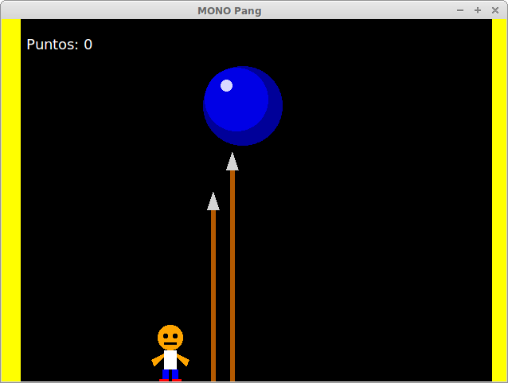

MONO Pang 
========
2014 Mario Macías

C#/Mono port of MOO Pang that I did to get introduced in such language. [Please refer to the original MOO Pang web wite for more information about MOO/MONO Pang](https://github.com/mariomac/MOOPang).

Compiling and executing
-----------------------

TO DO

How to play
-----------
Use cursor keys <- y -> to move left and right.

Use spacebar to shot arrows. If an arrow hits a ball, the ball will be divided into
two smaller balls. When balls are small enough they will disappear when are hit by
an arrow.

If a ball hits you, game is over.
